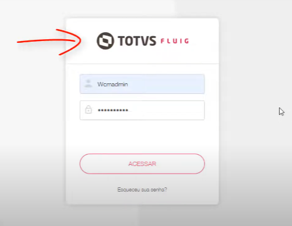
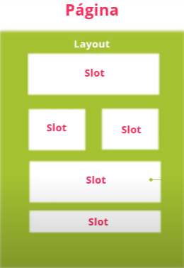

# Personalização Fluig
Link de acesso: https://academy.fluig.com/theme/totvs_fluig_academy/landpage.php?course=43
## O Que é WCM
O WCM (Web Content Management) e permite desenvolvermos portais com diferentes níveis de acesso a documentos e processos, liberdade para criar ambientes corporativos separados por departamento, área e/ou assuntos relevantes.
O Digital Workplace também é englobado dentro do WCM permitindo que tenhamos acesso de qualquer lugar para trabalharmos e, principalmente, autonomia para fazermos manutenção e alterarmos tudo do nosso jeito.

## Identidade Visual 
### Definindo identidade visual
Dentro do portal Fluig podemos alterar tudo, contanto que tenhamos permissão de admin.

Para alterar a identidade visual:
1. Acesse a plataforma Fluig
2. Vá em "Mais" e "Painel de Controle"
3. Acesse em "Personalização" a aba "Temas" (onde podemos escolher o tema e a skin)
4. Acesse "Gerenciar Tema" (ícone de engrenagem do lado do tema) e faça as alterações de logo, Favicon e cor de marca

> **TODAS** as mudanças feitas por um usuário "WCMadmin" será replicado para todas as plataformas criadas. Para alterar somente de uma empresa específica, faça login com o usuário "Admin" dela.
> Obs: para um tema ser aplicado, precisa deslogar e logar na plataforma.

### Como trocar a logo de login

1. Entre com o usuário WCMadmin 
2. Acesse "Painel de Controle"
3. Acesse "Configurações do Sistema"
4. Teremos acesso ao painel de troca de imagem para diversas áreas

## Composições de Páginas Fluig

### Estrutura das páginas
A página é composta por um **Layout** que define sua estrutura visual, servindo como interface para todos os usuários. Esse layout é dividido em **Slots**, que são áreas pré-definidas responsáveis por organizar o conteúdo na página. Dentro de cada slot, são inseridos ***Widgets**, que são pequenos aplicativos ou elementos interativos exibidos na tela. Os widgets permitem dinamismo e personalização na experiência do usuário.

### Recursos da Página

1. **Internacionalização em 3 idiomas** (i18n)
- PT-BR
- Espanhol
- Inglês

2. **Opções de Menu**
- Agrupados
- Sem agrupamento 

3. **Ícone nas Páginas**
- Coloque ícones nas páginas

### Widget
São extremamente importantes para estabelecer a interação do usuário com a página e com eles podemos ter:
- Componentes interativos
- Acesso centralizado
- Visualização de gráficos e dashboards
- Integração de aplicativos de maneira simplificada
- Acesso rápido a relatórios e documentos
- Acesso a endereços Web

> Obs: podemos usar os Widgets nativos ou criar via código (Treinamento Desenvolvimento de Portais WCN)

## Criando Portais
### Páginas
Antes de tudo, para editar qualquer coisa precisamos ter permissão de Admin.

Para criar uma página, siga esses passos:
1. Clique em "Mais" e "Painel de controle"
2. Vá em "Personalização" e clique em "Minhas Páginas"
3. Clique em "Adicionar" e a partir dai começaremos a criação da nossa cadeia de páginas
4. Escolha o Layout desejado
5. Preencha todos os espaços que tenham * 
6. O "Identificador Único" é um código que você cria e não pode ter caracteres especiais.
7. Caso queira, defina uma URL personalizada para acessar a página
8. Defina se sua página será "Pública" ou "Autenticada" (Página autenticada necessita do login do usuário) 
9. Defina as permissões para os usuários de "Alterar" ou "Excluir" a página
10. Faça a composição da página no próximo passo de Widgets

### Widgets
Em modo de edição, vamos continuar a edição mas na parte de widgets:

1. Clique em adicionar widget (escolhar o tipo desejado)
2. Configure do jeito que julgar necessário
3. Formate o texto que ficará presente em seu widget
4. Caso você prefira editar o texto da widget em HTML, só clicar no campo Source que sua edição será 100% em HTML
5. Adicione imagem se necessário. Você pode carregar uma imagem de seu computador e usar (para isso faça o upload da imagem para o ECM) ou colocar a URL de alguma imagem que venha da internet (Google, Facebook, Twitter etc)
6. Adicione quantas widgets quiser em um slot
7. Após termiar de configurar, clique no menu de "Configurações" e depois em "Publicar página", assim o seu conteúdo ficará disponível para acesso

